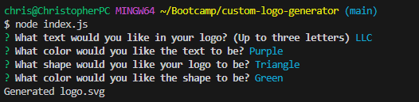

  # SVG Logo Generator

  

  ## Description

  Hi! Im Christopher Banta! Let me tell you a little about my project.

  ### What was my motivation for creating this project?
  
  I needed a simple logo and wanted to make it easy to make a new one each time I needed it.

  ### What problem does this solve?

  This makes creating and outputting simple SVG images very easy!

  ## Table of Contents

  - [Installation](#installation)
  - [Usage](#usage)
  - [License](#license)
  - [Contributing](#contributing)
  - [Tests](#tests)
  - [Questions](#questions)

  ## Installation

  Youre going to need to clone the Repo to your device using your preferred method. 

  ## Usage

  Once installed, run 'node index.js' in the integrated terminal and answer the questions on screen.

  

  [Web Video Demo](https://drive.google.com/file/d/1xgUKtuoO0uctWwb7BG1dyc9ysZKBtDxD/view)
  
  ## License

This project is covered under the MIT License license.

  ## Contributing

  N/A

  ## Tests

  `npm test` in the integrated terminal.

  ## Questions

  For any questions or further inquiries feel free to contact me at either of the following:
  
  Github: [BantaChristopher](https://github.com/BantaChristopher)

  Email: <chris.banta@rocketmail.com>

  